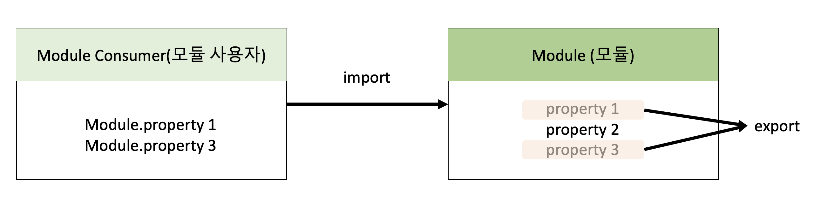
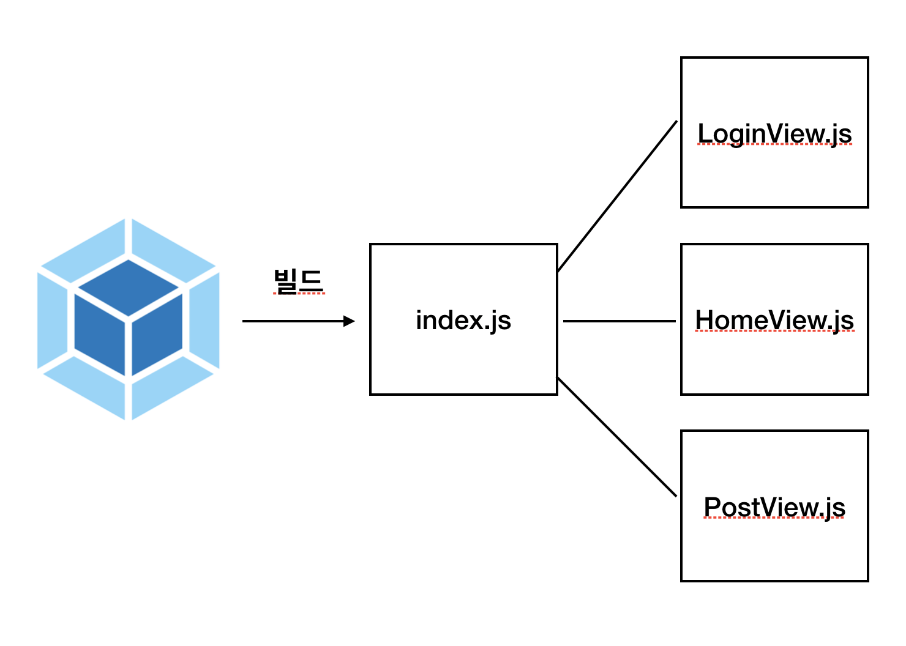

# 웹팩

## 강의 : [캡틴판교, 프론트엔드 개발자를 위한 웹팩](#https://www.inflearn.com/course/%ED%94%84%EB%9F%B0%ED%8A%B8%EC%97%94%EB%93%9C-%EC%9B%B9%ED%8C%A9/dashboard)

## 교안 : [웹팩 핸드북](https://joshua1988.github.io/webpack-guide/)

## 깃허브 : [바로가기](https://github.com/joshua1988/LearnWebpack)

```
제가 만드는 것보다는 캡틴판교님의 인프런 강의에서 설명하는 내용을 추가적으로 덧붙인 정리집입니다.
제공되는 교안인 '웹팩 핸드북'에 더욱 자세한 자료가 나와 있습니다!
```

## 강의에서 다루는 내용

- 프런트엔드 빌드 시스템 (NPM, Webpack)
- 자바스크립트 모듈화 (AMD, CommonJS, ES6 Modules)
- 웹팩 개요 (등장 배경, 철학 등)
- 웹팩 주요 속성 4가지
- 배포 환경에서 알고 있어야 할 웹팩 특징과 설정 등

## 목차

- [Node.js와 NPM](#Node.js와-NPM)
- [웹팩 시작하기](#웹팩-시작하기)
- [웹팩 소개](#웹팩-소개)
- [바벨과 ES6 모듈 문법](#바벨과-ES6-모듈-문법)
- [웹팩의 주요 속성 4가지](#웹팩의-주요-속성-4가지)
- [웹팩 데브 서버](#웹팩-데브-서버)

## Node.js와 NPM

### node 버전 확인하기

```
node -v
```

### npm 패키지 초기화하기

```
npm init / npm init -y (간단히)
```

### 라이브러리 설치하기

```
npm install 라이브러리명 / yarn add

npm install axios
```

### 라이브러리 제거하기

```
npm uninstall 라이브러리 명 / yarn remove

npm uninstall axios
```

### NPM 전역으로 설치하기 (--global)

```
npm install 라이브러리명 --global / npm install 라이브러리명 -g

npm install axios --global
```

전역으로 설치할 경우, 시스템 레벨에서 확인 가능하다. 시스템 레벨에서 사용할 자바스크립트 라이브러리를 설치할 때 사용합니다.

경로 📁 /usr/local/lib/node_modules

```
cd /usr/local/lib/node_modules
open .
```

전역에 설치된 라이브러리의 경우 해당 라이브러리에서 제공하는 cli를 자유롭게 사용할 수 있다는 장점이 있다.

### NPM 지역으로 설치하기 (--save-dev)

```
npm install axios --save-prod / npm i
```

지역 설치 명령어의 경우 명령어 옵션으로 --save-prod 를 붙이지 않아도 동일한 효과가 납니다. 또한 install 대신 i를 사용해도 됩니다.

### NPM 지역 설치 옵션 2가지

지역 설치 명령어의 경우 자주 사용되는 2가지 옵션은 다음과 같습니다.

```
npm install axios --save-prod

npm install axios --save-dev
```

위 명령어는 아래와 같이 각각 축약할 수 있습니다.

```
npm i axios

npm i axios -D
```

① 설치 옵션에 아무것도 넣지 않은 npm i 는 package.json의 dependencies에 등록됩니다.

```
  "dependencies": {
    "axios": "^0.21.4"
  }
```

② 설치 옵션으로 -D를 넣은 경우에는 해당 라이브러리가 package.json의 devDependencies에 등록됩니다.

```
{
  "devDependencies": {
    "axios": "^0.21.4"
  }
}

```

### ① dependencies와 ② devDependencies의 차이점

① dependencies는 애플리케이션의 동작과 관련이 있습니다

```
  "dependencies": {
    "axios": "^0.21.4"
    "react" : "",
  }
```

② devDependencies는 개발을 할 때 도움을 주는 개발용 보조 라이브러리를 의미합니다

```
{
  "devDependencies": {
    "webpack": "",
    "":""
  }
}

```

### ① dependencies와 ② devDependencies 구분하기

설치된 배포용 라이브러리는 npm run build 로 빌드를 하면 최종 애플리케이션 코드 안에 포함됩니다.

그런데 만약 반대로 설치 옵션에 -D를 주었다면 해당 라이브러리는 빌드하고 배포할 때 애플리케이션 코드에서 빠지게 됩니다. 따라서, 최종 애플리케이션에 포함되어야 하는 라이브러리는 -D로 설치하면 안 됩니다. 개발할 때만 사용하고 배포할 때는 빠져도 좋은 라이브러리의 예시는 다음과 같습니다.

```
webpack: 빌드 도구
eslint: 코드 문법 검사 도구
imagemin: 이미지 압축 도구
```

## 웹팩 시작하기

### 웹팩이란?

웹팩이란 최신 프런트엔드 프레임워크에서 가장 많이 사용되는 모듈 번들러(Module Bundler)입니다. 모듈 번들러란 웹 애플리케이션을 구성하는 자원(HTML, CSS, Javscript, Images 등)을 모두 각각의 모듈로 보고 이를 조합해서 병합된 하나의 결과물을 만드는 도구를 의미합니다.


### 모듈이란?

모듈이란 프로그래밍 관점에서 특정 기능을 갖는 작은 코드 단위를 의미합니다. 자바스크립트로 치면 아래와 같은 코드가 모듈입니다.

```js
// 📁 math.js

function sum(a, b) {
  return a + b;
}

function substract(a, b) {
  return a - b;
}

const PI = 3.14;

export { sum, substract, PI };
```

이 math.js 파일은 아래와 같이 3가지 기능을 갖고 있는 모듈입니다.

- 두 숫자의 합을 구하는 sum() 함수
- 두 숫자의 차를 구하는 substract() 함수
- 원주율 값을 갖는 PI 상수

이처럼 성격이 비슷한 기능들을 하나의 의미있는 파일로 관리하면 모듈이 됩니다.

### 웹팩에서의 모듈

웹팩에서 지칭하는 모듈이라는 개념은 위와 같이 자바스크립트 모듈에만 국한되지 않고 웹 애플리케이션을 구성하는 모든 자원을 의미합니다. 웹 애플리케이션을 제작하려면 HTML, CSS, Javascript, Images, Font 등 많은 파일들이 필요하죠. 이 파일 하나하나가 모두 모듈입니다.

### 모듈 번들링이란?

아래 그림과 같이 웹 애플리케이션을 구성하는 몇십, 몇백개의 자원들을 하나의 파일로 병합 및 압축 해주는 동작을 모듈 번들링이라고 합니다.

파일들의 연관된 관계를 파악하여 파일들을 하나의 파일로 압축시켜주는 과정을 번들링 과정이라 합니다.


## 웹팩 소개

### 웹팩의 등장 배경

웹팩이 등장한 이유는 크게 3가지입니다.

1. 파일 단위의 자바스크립트 모듈 관리의 필요성
2. 웹 개발 작업 자동화 도구
3. 웹 애플리케이션의 빠른 로딩 속도와 높은 성능

#### 파일 단위의 자바스크립트 모듈 관리의 필요성

입문자 관점에서 고안된 자바스크립트는 아래와 같이 편리한 유효 범위를 갖고 있습니다.

```js
var window = 10;
console.log(window); // 10

function logText() {
  console.log(window); // 10
}
```

자바스크립트의 변수 유효 범위는 기본적으로 전역 범위를 갖습니다. 최대한 넓은 변수 범위를 갖기 때문에 어디에서도 접근하기가 편리하죠.

그런데 이러한 장점이 실제로 웹 애플리케이션을 개발할 때는 아래와 같은 문제점으로 변합니다.

```html
<!-- index.html -->
<html>
  <head>
    <!-- ... -->
  </head>
  <body>
    <!-- ... -->
    <script src="./app.js"></script>
    <script src="./main.js"></script>
    <script>
      getNum(); // ??
    </script>
  </body>
</html>
```

각각 다른 파일(app, main)에서 의도치 않게 같은 함수를 정의하고 호출했을 때, index.html에서는 어떤 함수를 불러오게 될까요?

```js
// app.js
var num = 10;
function getNum() {
  console.log(num);
}
```

```js
// main.js
var num = 20;
function getNum() {
  console.log(num);
}
```

결과는 가장 나중에 불러오게 되는 script 파일인 main.js에 선언된 값 20입니다.

app.js에서 선언한 num 변수는 main.js에서 다시 선언하고 20을 할당했기 때문이죠.

이러한 문제점은 실제로 복잡한 애플리케이션을 개발할 때 발생합니다. 변수의 이름을 모두 기억하지 않은 이상 변수를 중복 선언하거나 의도치 않은 값을 할당할 수 있죠.

이처럼 파일 단위로 변수를 관리하고 싶은 욕구, 자바스크립트 모듈화에 대한 욕구를 예전까진 AMD, Common.js와 같은 라이브러리로 풀어왔습니다.

#### 웹 개발 작업 자동화 도구

이전부터 프런트엔드 개발 업무를 할 때 가장 많이 반복하는 작업은 텍스트 편집기에서 코드를 수정하고 저장한 뒤 브라우저에서 새로 고침을 누르는 것이었습니다. 그래야 화면에 변경된 내용을 볼 수 있었죠.

이외에도 웹 서비스를 개발하고 웹 서버에 배포할 때 아래와 같은 작업들을 해야 했습니다.

- HTML, CSS, JS 압축
- 이미지 압축
- CSS 전처리기 변환

이러한 일들을 자동화 해주는 도구들이 필요했습니다. 그래서 Grunt와 Gulp 같은 도구들이 등장했습니다.

#### 웹 애플리케이션의 빠른 로딩 속도와 높은 성능

일반적으로 특정 웹 사이트를 접근할 때 5초 이내로 웹 사이트가 표시되지 않으면 대부분의 사용자들은 해당 사이트를 벗어나거나 집중력을 잃게 됩니다.

그래서 웹 사이트의 로딩 속도를 높이기 위해 많은 노력들이 있었습니다. 그 중 대표적인 노력이 브라우저에서 서버로 요청하는 파일 숫자를 줄이는 것입니다. 이를 위해 앞에서 살펴본 웹 태스크 매니저를 이용해 파일들을 압축하고 병합하는 작업들을 진행했습니다.

뿐만 아니라 초기 페이지 로딩 속도를 높이기 위해 나중에 필요한 자원들은 나중에 요청하는 레이지 로딩(Lazy Loading)이 등장했죠.

웹팩은 기본적으로 필요한 자원은 미리 로딩하는게 아니라 그 때 그 때 요청하자는 철학을 갖고 있습니다.

#### 🔥 [유튜브 링크: Webpack from First Principles](https://www.youtube.com/watch?v=WQue1AN93YU)

여기 해당 버튼을 클릭하면 크로커다일을 불러오는 웹 애플리케이션이 있습니다.

구조는 다음과 같습니다. (tree 참조)


해당 애플리케이션의 리소스를 불러오는 요청 과정에서 쓰로틀링이 생기지 않는 쾌적한 환경일 경우, 약 100ms (0.1초) 밖에 걸리지 않습니다.

디렉토리별로 각각의 파일이 존재하지만, 쾌적한 환경에서는 시간이 얼마 걸리지 않습니다.

#### 💨 쾌적한 환경 (non throttle)


하지만 지구 반대편에서 해당 애플리케이션에 접근한다면 인터넷 속도 등의 다양한 외부요인에 의해 리소스를 불러오는 과정에 시간이 오래 걸릴 수 있습니다.

#### 🔥 쾌적하지 않은 환경 (throttle)


약 1300ms (1.3)초 가량으로 늘어난 것을 볼 수 있습니다.

이렇게 인터넷 환경에 따라 서버로부터 전달 받은 리소스 (html/css/js/ svg / ..) 들을 화면에 렌더링할 때 각각의 파일로 저장되어 있다면, 결과적으로 불러오는데 시간이 오래 걸릴 수 있습니다.

이런 상황을 해결하기 위해 우리는 webpack을 사용합니다.


웹팩의 번들링 과정을 통해서 각 파일을 bundle.js에 몰아서 넣었고, 번들링된 bundle.js에서 각 모듈을 불러오니, 파일에 각각 접근하는 것보다 시간이 훨씬 절약됩니다. 이것이 우리가 웹팩을 사용하는 이유입니다.

### 웹팩으로 해결하려는 문제 ?

웹팩의 등장 배경에서도 살펴봤지만 웹팩에서 해결하고자 하는 기존의 문제점은 다음 4가지 입니다.

- 자바스크립트 변수 유효 범위
- 브라우저별 HTTP 요청 숫자의 제약
- 사용하지 않는 코드의 관리

#### 자바스크립트 변수 유효 범위 문제

웹팩은 변수 유효 범위의 문제점을 ES6의 Modules 문법과 웹팩의 모듈 번들링으로 해결합니다.

#### 브라우저별 HTTP 요청 숫자의 제약

TCP 스펙에 따라 브라우저에서 한 번에 서버로 보낼 수 있는 HTTP 요청 숫자는 제약되어 있습니다. 아래의 표는 최신 브라우저 별 최대 HTTP 요청 횟수입니다.

| 브라우저          | 최대 연결 횟수 |
| :---------------- | :------------- |
| 익스플로러 7      | 2              |
| 익스플로러 8, 9   | 6              |
| 익스플로러 10, 11 | 8, 13          |
| 크롬              | 6              |
| 사파리            | 6              |
| 파이어폭스        | 6              |
| 오페라            | 6              |
| 안드로이드, ios   | 6              |

따라서, HTTP 요청 숫자를 줄이는 것이 웹 애플리케이션의 성능을 높여줄 뿐만 아니라 사용자가 사이트를 조작하는 시간을 앞당겨 줄 수 있습니다.

## 바벨과 ES6 모듈 문법

### 바벨

바벨은 자바스크립트에서 지원하는 최신 문법 (ES6, ES7, ES8, ES9, ...) 들을 최대한 많은 브라우저 환경에서 호환이 가능하도록 변환해주는(트랜스파일링해주는) 언어입니다.

#### 트랜스파일(transpile)


#### 바벨 변환

바벨을 사용하면 거대한 변화가 생기기 시작한 기점인 ES6 (ECMAScript 2015) 이후의 문법을 브라우저에서 범용적으로 사용되는 문법 단계로 변환해줄 수 있습니다.

```js
// Babel Input: ES2015 arrow function
[1, 2, 3].map((n) => n + 1);

// Babel Output: ES5 equivalent
[1, 2, 3].map(function (n) {
  return n + 1;
});
```

### 모듈의 일반적 의미

<b>모듈(module)이란 애플리케이션을 구성하는 개별적 요소로서 재사용 가능한 코드 조각</b>을 말한다.

일반적으로 모듈은 <b>기능을 기준으로 파일 단위로</b> 분리한다. 이때 모듈이 성립하려면 모듈은 자신만의 파일 스코프(모듈 스코프)를 가질 수 있어야 한다.

자신만의 파일 스코프를 갖는 모듈의 자산(모듈에 포함되어 있는 변수, 함수, 객체 등)은 기본적으로 <b>비공개 상태다.</b> 다시 말해, 자신만의 파일 스코프를 갖는 모듈의 모든 자산은 <b>캡슐화되어 다른 모듈에서 접근할 수 없다. 즉, 모듈은 개별적 존재로서 애플리케이션과 분리되어 존재한다.</b>

하지만 애플리캐이션과 완전히 분리되어 개별적으로 존재하는 모듈은 재사용이 불가능하므로 존재의 의미가 없다.

따라서 모듈은 <b>공개가 필요한 자산에 한정하여 명시적으로 선택적 공개가 가능하다. 이를 export라 한다.</b>

공개(export)의 자산은 다른 모듈에서 재사용할 수 있다. (의존성을 갖게 된다)

이때 <b>공개된 모듈의 자산을 사용하는 모듈을 모듈 사용자(module consumer)라 한다. 모듈 사용자는 모듈이 공개(export)한 자산 중 일부 또는 전체를 선택해 자신의 스코프 내로 불러들여 재사용할 수 있다. 이를 import라 한다.</b>



### 자바스크립트와 모듈

자바스크립트는 웹페이지의 단순한 보조 기능을 처리하기 위한 제한적인 용도를 목적으로 태어났다.

이러한 태생적 한계로 인해 다른 프로그래밍 언어와 비교할 때 부족한 부분이 있다. 대표적으로 모듈 시스템을 지원하지 않는다는 것이다.

다시 말해, <b>자바스크립트는 모듈이 성립하기 위해 필요한 파일 스코프와 import, export를 지원하지 않는다.</b>

또한 클라이언트 사이드인 자바스크립트는 script 태그를 사용하여 외부의 자바스크립트 파일을 로드할 수는 있지만 파일마다 독립적인 파일 스코프를 갖지 않는다.

다시 말해, 자바스크립트 파일을 여러 개의 파일로 분리하여 script 태그로 로드해도, 분리된 자바스크립트 파일들은 결국 하나의 자바스크립트 파일 내에 있는 것처럼 동작한다.

따라서 분리된 자바스크립트 파일들의 전역 변수가 중복되는 등의 문제가 발생할 수 있다.

자바스크립트를 클라이언트 사이드, 즉 브라우저 환경에 국한하지 않고 범용적으로 사용하려는 움직임이 생기면서 이러한 상황에 제안된 것이 CommonJS와 AMD(asynchronous module definition)다.

자바스크립트 런타임 환경인 Node.js는 모듈 시스템의 사실상 표준인 CommonJS를 채택했고 독자적인 진화를 거쳐, 현재는 CommonJS 사양과 100% 동일하지는 않지만 기본적으로 CommonJS 사양을 따르고 있다.

즉, Node.js는 ECMAScript 표준 사양은 아니지만 모듈 시스템을 지원한다. 따라서 Node.js 환경에서는 파일별로 독립적인 파일 스코프(모듈 스코프)를 갖는다.

### ES6 모듈(ESM)

이러한 상황에서 ES6에서는 클라이언트 사이드 자바스크립트에서도 동작하는 모듈 기능을 추가했다.

ES6 모듈(이하 ESM 모듈)은 script 태그에 type="module" 어트리뷰트를 추가하면 로드된 자바스크립트 파일은 모듈로서 동작한다.

일반적인 자바스크립트 파일이 아닌 ESM임을 명확히 하기 위해 ESM의 파일 확장자는 mjs를 사용할 것을 권장한다.

```js
<script type="module" src="app.mjs"></script>
```

### 모듈 스코프

ESM은 독자적인 모듈 스코프를 갖는다. ESM이 아닌 일반적인 자바스크립트 파일은 script 태그로 분리해서 로드해도 독자적인 모듈 스코프를 갖지 않는다.

```js
// 📁 foo.js
// x 변수는 전역 변수다.
var x = "foo";
console.log(window.x); // foo
```

```js
// 📁 bar.js
// x 변수는 전역 변수다. foo.js에서 선언한 전역 변수 x와 중복된 선언이다.
var x = "bar";

// foo.js에서 선언한 전역 변수 x의 값이 재할당되었다.
console.log(window.x); // bar
```

```html
<!DOCTYPE html>
<html>
  <body>
    <script src="foo.js"></script>
    <script src="bar.js"></script>
  </body>
</html>
```

위 예제의 HTML에서 script 태그로 분리해서 로드된 2개의 자바스크립트 파일은 하나의 자바스크립트 파일 내에 있는 것처럼 동작한다.

즉, 하나의 전역을 공유한다. 따라서 x 변수는 중복 선언되며 의도치 않게 x 변수의 값이 덮어써진다.

ESM은 이러한 문제를 독자적인 모듈 스코프를 제공하기 때문에 해결할 수 있다.

```js
// 📁 foo.mjs
// x 변수는 전역 변수가 아니며 window 객체의 프로퍼티도 아니다.
var x = "foo";
console.log(x); // foo
console.log(window.x); // undefined
```

```js
// 📁 bar.mjs
// x 변수는 전역 변수가 아니며 window 객체의 프로퍼티도 아니다.
// foo.mjs에서 선언한 x 변수와 스코프가 다른 변수다.
var x = "bar";
console.log(x); // bar
console.log(window.x); // undefined
```

```html
<!DOCTYPE html>
<html>
  <body>
    <script type="module" src="foo.mjs"></script>
    <script type="module" src="bar.mjs"></script>
  </body>
</html>
```

모듈 내에 선언한 식별자는 모듈 외부에서 참조할 수 없다. 모듈 스코프가 다르기 때문이다.

### export

앞서 말했듯이 모듈을 외부에서 참조하지 못한다면, 즉 재사용가능하지 않다면 만들 필요가 없다.

따라서 필요한 자산들을 외부에서 참조할 수 있도록 export(공개) 키워드를 사용한다.

```js
// 📁 lib.mjs
// 변수의 공개
export const pi = Math.PI;

// 함수의 공개
export function square(x) {
  return x * x;
}

// 클래스의 공개
export class Person {
  constructor(name) {
    this.name = name;
  }
}
```

선언문 앞에 매번 export 키워드를 붙이는 것이 번거롭다면 export 할 대상을 하나의 객체로 구성하여 한 번에 export할 수도 있다.

```js
// 📁 lib.mjs
const pi = Math.PI;

function square(x) {
  return x * x;
}

class Person {
  constructor(name) {
    this.name = name;
  }
}

// 변수, 함수 클래스를 하나의 객체로 구성하여 공개
export { pi, square, Person };
```

### import

다른 모듈에서 공개(export)한 식별자를 자신의 모듈 스코프 내부로 로드하려면 import 키워드를 사용한다. 다른 모듈이 export한 식별자 이름으로 import해야 하며 <b>ESM의 경우 파일 확장자를 생략할 수 없다.</b>

```js
// 📁 app.mjs
// 같은 폴더 내의 lib.mjs 모듈이 export한 식별자 이름으로 import한다.
// ESM의 경우 파일 확장자를 생략할 수 없다.
import { pi, square, Person } from "./lib.mjs";

console.log(pi); // 3.141592653589793
console.log(square(10)); // 100
console.log(new Person("Lee")); // Person { name: 'Lee' }
```

모듈이 export한 식별자 이름을 일일이 지정하지 않고 하나의 이름으로 한 번에 import할 수도 있다.

<b>이때 import 되는 식별자는 as 뒤에 지정한 이름의 객체에 프로퍼티로 할당된다.</b>

```js
// 📁 app.mjs
import * as lib from "./lib.mjs";

console.log(lib.pi); // 3.141592653589793
console.log(lib.square(10)); // 100
console.log(new lib.Person("Lee")); // Person { name: 'Lee' }
```

모듈이 export한 식별자 이름을 변경하여 import 할 수도 있다.

```js
// 📁 app.mjs
import { pi as PI, square as sq, Person as P } from "./lib.mjs";

console.log(PI); // 3.141592653589793
console.log(sq(2)); // 4
console.log(new P("Kim")); // Person { name: 'Kim' }
```

모듈에서 하나의 값만 export한다면 default 키워드를 사용할 수 있다.

default 키워드와 함께 export한 모듈은 { } 중괄호 없이 임의의 이름으로 import할 수 있다.

```js
// 📁 app.mjs
import square from "./lib.mjs";

console.log(square(3)); // 9
```

## 웹팩의 주요 속성 4가지

웹팩의 빌드(파일 변환) 과정을 이해하기 위해서는 아래 4가지 주요 속성에 대해서 알고 있어야 합니다.

- entry
- output
- loader
- plugin

### entry

<b>entry</b> 속성은 웹팩에서 웹 자원을 변환하기 위해 필요한 최초 진입점이자 자바스크립트 파일 경로입니다.
빌드를 할 대상 파일의 위치라고 볼 수 있습니다

```js
// webpack.config.js
module.exports = {
  entry: "./src/index.js",
};
```

위 코드는 웹팩을 실행했을 때 src 폴더 밑의 index.js 을 대상으로 웹팩이 빌드를 수행하는 코드입니다.

<b>entry</b> 속성에 지정된 파일에는 웹 애플리케이션의 전반적인 구조와 내용이 담겨져 있어야 합니다. 웹팩이 해당 파일을 가지고 웹 애플리케이션에서 사용되는 모듈들의 연관 관계를 이해하고 분석하기 때문에 애플리케이션을 동작시킬 수 있는 내용들이 담겨져 있어야 합니다.

```js
// index.js
import LoginView from "./LoginView.js";
import HomeView from "./HomeView.js";
import PostView from "./PostView.js";

function initApp() {
  LoginView.init();
  HomeView.init();
  PostView.init();
}

initApp();
```

싱글 페이지 애플리케이션으로 작성된 index.js를 예로 들어보겠습니다. 3개의 컴포넌트를 index.js에 불러와서 실행을 하고있는 구조입니다.

사용자의 로그인 화면, 로그인 후 진입하는 메인 화면, 그리고 게시글을 작성하는 화면 등 웹 서비스에 필요한 화면들이 모두 index.js 파일에서 불려져 사용되고 있기 때문에 웹팩을 실행하면 해당 파일들의 내용까지 해석하여 파일을 빌드해줄 것입니다.



### options

하지만 entry의 경우 엔트리 포인트가 1개가 될 수도 있지만 아래와 같이 여러 개가 될 수도 있습니다.

```
entry: {
  login: './src/LoginView.js',
  main: './src/MainView.js'
}
```

위와 같이 엔트리 포인트를 분리하는 경우는 싱글 페이지 애플리케이션이 아닌 특정 페이지로 진입했을 때 서버에서 해당 정보를 내려주는 형태의 멀티 페이지 애플리케이션에 적합합니다.

### output

<b>output</b> 속성은 웹팩을 돌리고 난 결과물의 파일 경로를 의미합니다.

```js
// webpack.config.js
module.exports = {
  output: {
    filename: "bundle.js",
  },
};
```

앞에서 배운 entry 속성과는 다르게 객체 형태로 옵션들을 추가해야 합니다.

최소한 <b>filename</b>은 지정해줘야 하며 일반적으로 아래와 같이 path 속성을 함께 정의합니다.

```js
// webpack.config.js
var path = require("path");

module.exports = {
  output: {
    filename: "bundle.js",
    path: path.resolve(__dirname, "./dist"),
  },
};
```

- filename 속성은 웹팩으로 빌드(번들링)한 파일의 이름을 의미합니다.
- path 속성은 해당 파일의 경로를 의미합니다.
- path 속성에서 사용된 path.resolve() 코드는 인자로 넘어온 경로들을 조합하여 유효한 파일 경로를 만들어주는 Node.js API입니다.

따라서 dist 라는 폴더 안에 있는 bundle.js라는 파일 이름으로 엔트리에 들어온 파일을 빌드(번들링)하여 결과물로 가져올 것입니다.

### options

앞에서 살펴본 filename 속성에 여러 가지 옵션을 넣을 수 있습니다.

1. 결과 파일 이름에 entry 속성을 포함하는 옵션

```js
module.exports = {
  output: {
    filename: "[name].bundle.js",
  },
};
```

2. 결과 파일 이름에 웹팩 내부적으로 사용하는 모듈 ID를 포함하는 옵션

```js
module.exports = {
  output: {
    filename: "[id].bundle.js",
  },
};
```

3. 🔥[그 밖의 옵션 보기](https://joshua1988.github.io/webpack-guide/concepts/output.html#output-%ED%8C%8C%EC%9D%BC-%EC%9D%B4%EB%A6%84-%EC%98%B5%EC%85%98)

### loader

로더(Loader)는 웹팩이 웹 애플리케이션을 해석할 때 자바스크립트 파일이 아닌 웹 자원(HTML, CSS, Images, 폰트 등)들을 빌드 시에, 자바스크립트의 output(산출물) 파일에 포함될 수 있도록 도와주는 속성입니다.

```js
// webpack.config.js
module.exports = {
  module: {
    rules: [],
  },
};
```

엔트리나 아웃풋 속성과는 다르게 <b>module</b>라는 이름을 사용합니다.

#### 🔥 로더가 없는 경우

로더는 앞서 말한대로 js 이외 형식의 파일들을 빌드할 때 추가하는 속성이라고 볼 수 있다.

만약 js 파일 내에 css 파일이 import 된 상황에서 loader가 없다면 어떻게 될까?

빌드가 제대로 되는 지 확인해보자

```js
📁 index.js

import "./base.css";
```

빌드를 한다면 다음과 같은 에러를 볼 수 있을 것이다.


빌드 시에, 엔트리로 설정한 index.js 파일 내에 웹팩이 알아볼 수 없는 파일 형식자인 css가 포함되어서 이를 해석할 수 없다는 에러를 발생시켰다.

위와 같이 원래 목적인 js를 변환하는 것이 아니라면 loader를 통해 같이 빌드할 수 있는 여건을 만들어 줘야 한다

```js
📁 webpack.config.js

var path = require("path");

module.exports = {
  mode: "none", // production, development, none >> 배포 시에는 production으로 설정해야 한다
  entry: "./index.js",
  output: {
    filename: "bundle.js",
    path: path.resolve(__dirname, "dist"),
  },
  module: {
    rules: [
      {
        // 'test'는 확장자를 의미한다
        test: /\.css$/,
        // 'use'는 해당 파일들을 어떤 방향으로 로딩하는지 설정해주는 것이다

        // css-loader는 웹팩 안에 css 파일을 같이 번들링할 수 있도록 만드는 용도이다
        // style-loader는 해당 css를 html 파일 내에 인라인 코드로 실제 스타일에 적용하는 용도로 사용된다

        // 🔥 순서(오른쪽 to 왼쪽으로 적용) 또한 영향이 있으니, 먼저 적용되야 하는 로더를 오른쪽에 작성해야 한다
        use: ["style-loader", "css-loader"],
      },
      // 만든 바벨 로더 예시
      // {
      //   test: /\.js$/, test > 확장자
      //   use: ["babel-loader"], use > 사용할 라이브러리
      // },
    ],
  },
};
```

### plugin

## 웹팩 데브 서버
